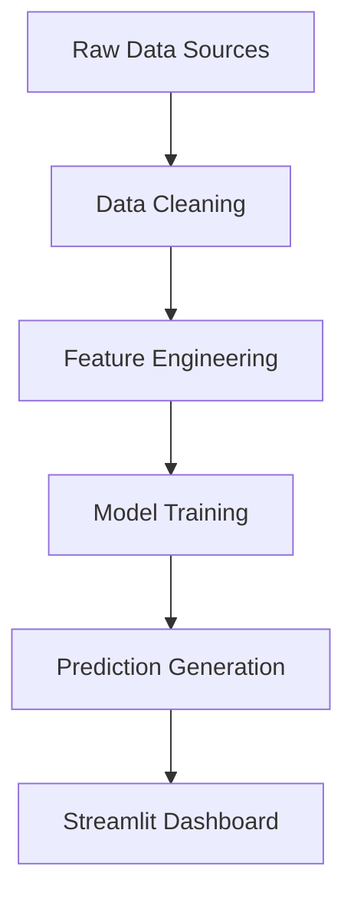

# 🇺🇳 United Nation Financial Intelligence Dashboard

> **A comprehensive AI-powered analytics platform for UN JointWork Plans financial data analysis, featuring predictive modeling, anomaly detection, and intelligent chatbot assistance.**

[](https://www.python.org/downloads/)
[](https://streamlit.io/)
[](LICENSE.md)

---

## 🌟 **Project Overview**

This dashboard provides comprehensive analysis of UN JointWork Plans financial data, enabling insights into funding patterns, resource allocation, and collaboration trends across different regions, themes, and UN agencies. Built with advanced machine learning models and an AI-powered chatbot for intelligent data exploration.

### **🎯 Key Features**
- 💰 **Funding Gap Analysis** - Identify and predict funding shortfalls across regions and themes with 48MB+ unified dataset
- 🌍 **Regional Intelligence** - Compare performance across 5 regions: Africa, Asia Pacific, Arab States, Europe & Central Asia, Latin America
- 🎯 **Thematic Analysis** - Deep dive into 11 themes: education, governance, environment, gender equality, crime, digital, food, poverty, water, work, youth
- 🤖 **AI-Powered Chat** - Interactive Azure OpenAI GPT-4o/O1 assistant with RAG implementation for intelligent data exploration
- 📊 **Predictive Modeling** - Multi-label ML models (88%+ accuracy) for SDG goals and agency recommendations using XGBoost, LightGBM, CatBoost
- 🔍 **Anomaly Detection** - Real-time identification of unusual patterns using IsolationForest and OneClassSVM algorithms
- 📈 **Dynamic Analytics** - Automated feature engineering and real-time data processing pipeline

---

## 🏗️ **Complete Workflow Architecture**

### **1. Data Pipeline & Processing**


#### **📥 Data Sources**
- **Raw Regional Data**: [`src/data/`](src/data/) - 55 Excel files (11 themes × 5 regions) containing thematic project data
  - Africa, Asia Pacific, Arab States, Europe & Central Asia, Latin America and the Caribbean
  - Themes: crime, digital, education, environment, food, gender, governance, poverty, water, work, youth
- **Core Datasets**: [`src/notebooks/`](src/notebooks/)
  - **Financial.csv** (~10.0 MB) - Main funding, expenditure, and gap analysis data
  - **SDG_Goals.csv** (~2.2 MB) - Sustainable Development Goals alignment and analysis
  - **UN_Agencies.csv** (~2.4 MB) - UN agency collaboration and performance metrics
- **Processed Data**: [`src/outputs/data_output/`](src/outputs/data_output/) - Production-ready datasets
  - **unified_data.csv** (48 MB) - Comprehensive unified dataset for analysis
  - **Financial_Cleaned.csv** (9.5 MB) - Cleaned financial data
  - **SDG_Goals_Cleaned.csv** (1.4 MB) - Processed SDG mappings
  - **UN_Agencies_Cleaned.csv** (1.4 MB) - Cleaned agency collaboration data

#### **🔧 Data Cleaning & Processing**
- **Main Processor**: [`src/notebooks/data_cleaning.ipynb`](src/notebooks/data_cleaning.ipynb) - Comprehensive data preprocessing pipeline
- **Configuration**: [`src/commonconst.py`](src/commonconst.py) - Central constants, paths, and utility functions
- **Outputs**: [`src/outputs/data_output/`](src/outputs/data_output/) - Cleaned and processed datasets

### **2. Machine Learning Models**

#### **🎯 SDG Prediction Model**
- **Training Notebook**: [`src/notebooks/sdg.ipynb`](src/notebooks/sdg.ipynb) - Multi-label classification pipeline with 88%+ accuracy
- **Model File**: [`src/outputs/model_output/SDG_model.pkl`](src/outputs/model_output/SDG_model.pkl) (11 MB) - OneVsRestClassifier with feature engineering
- **Purpose**: Predict relevant Sustainable Development Goals based on country, theme, and strategic priorities

#### **🏢 Agency Recommendation Model**  
- **Training Notebook**: [`src/notebooks/agency.ipynb`](src/notebooks/agency.ipynb) - Advanced ensemble modeling with RandomForest, XGBoost, CatBoost
- **Model File**: [`src/outputs/model_output/Agency_model.pkl`](src/outputs/model_output/Agency_model.pkl) (33 MB) - Optimized multi-label classifier
- **Purpose**: Recommend optimal UN agencies for collaboration based on project characteristics and historical performance

#### **💰 Funding Prediction System**
- **Analysis Notebook**: [`src/notebooks/funding.ipynb`](src/notebooks/funding.ipynb) - Time series analysis and gap prediction
- **Output**: [`src/outputs/model_output/funding_prediction.csv`](src/outputs/model_output/funding_prediction.csv) (9.5 MB) - Comprehensive funding forecasts
- **Purpose**: Forecast funding requirements, identify potential gaps, and optimize resource allocation

#### **🔍 Anomaly Detection Engine**
- **Detection Notebook**: [`src/notebooks/anomaly.ipynb`](src/notebooks/anomaly.ipynb) - IsolationForest and OneClassSVM implementation
- **Output**: [`src/outputs/model_output/anomaly_detection.csv`](src/outputs/model_output/anomaly_detection.csv) (9.9 MB) - Anomaly scores and flagged records
- **Purpose**: Real-time identification of unusual patterns in strategic priorities and resource allocation

#### **🏅 Agency Performance Analysis**
- **Performance Data**: [`src/outputs/model_output/un_agency.csv`](src/outputs/model_output/un_agency.csv) (9.6 MB) - Agency clustering and performance metrics
- **Purpose**: Evaluate UN agency collaboration effectiveness and identify top performers

### **3. Streamlit Application Architecture**

#### **🚀 Main Application**
- **Entry Point**: [`app.py`](app.py) - Streamlined navigation with 5 dashboard pages (16 lines)
- **Dependencies**: [`requirements.txt`](requirements.txt) - Optimized Python package dependencies with version constraints
- **Secrets Management**: [`.streamlit/secrets.toml`](.streamlit/secrets.toml) - Azure OpenAI GPT-4o/O1 API configuration

#### **📱 Dashboard Pages**
- **🌟 Overview**: [`pages/overview.py`](pages/overview.py) (1,023 lines) - Executive summary and system architecture
- **🏠 Dashboard**: [`pages/main_page.py`](pages/main_page.py) (818 lines) - Interactive financial analysis with dynamic filtering
- **📊 Analysis**: [`pages/prediction.py`](pages/prediction.py) (1,253 lines) - ML model results, trends, and insights generation
- **🎯 Models**: [`pages/model.py`](pages/model.py) (375 lines) - Real-time predictions and scenario modeling interface
- **🤖 Chatbot**: [`pages/bot.py`](pages/bot.py) (371 lines) - Azure OpenAI-powered conversational interface with RAG

#### **🧠 AI Integration & Styling**
- **AI Modules**: [`src/prompt/`](src/prompt/) - Specialized AI prompt engineering modules
  - [`chatbot.py`](src/prompt/chatbot.py) (409 lines) - GPT-4o conversational AI with dynamic context
  - [`dashboard.py`](src/prompt/dashboard.py) (219 lines) - O1 model for strategic dashboard insights
  - [`models.py`](src/prompt/models.py) (329 lines) - GPT-4o for predictive model analysis
  - [`funding_prediction.py`](src/prompt/funding_prediction.py) (219 lines) - O1 model for funding insights
  - [`anomaly_detection.py`](src/prompt/anomaly_detection.py) (216 lines) - O1 model for anomaly analysis
  - [`agency_performance.py`](src/prompt/agency_performance.py) (216 lines) - O1 model for agency insights
- **CSS Styling**: [`pages/style/style.css`](pages/style/style.css) - Custom UN-themed UI styling
- **Configuration**: [`src/commonconst.py`](src/commonconst.py) (763 lines) - Consolidated imports, constants, and utilities

---

## ⚡ **Quick Start Guide**

### **1. Installation**
```bash
# Clone the repository
git clone https://github.com/your-username/United_Nations_Legacy.git
cd United_Nations_Legacy

# Install dependencies  
pip install -r requirements.txt

# Configure Azure OpenAI credentials
cp .streamlit/secrets.toml.example .streamlit/secrets.toml
# Edit secrets.toml with your API keys
```

### **2. Data Setup**

#### **📋 Required Data Files**
Due to file size constraints, the following data files are excluded from version control but are required for the application:

**Core Datasets** (place in `src/notebooks/`):
- `Financial.csv` (~10.4 MB) - Main financial dataset with funding, expenditure, and gap analysis
- `SDG_Goals.csv` (~2.3 MB) - Sustainable Development Goals mapping and analysis data  
- `UN_Agencies.csv` (~2.5 MB) - UN agency collaboration and performance data

**Regional Data** (organize in `src/data/`):
- `Africa/` - 11 thematic Excel files (crime, digital, education, environment, food, gender, governance, poverty, water, work, youth)
- `Arab States/` - 11 thematic Excel files
- `Asia Pacific/` - 11 thematic Excel files
- `Europe and Central Asia/` - 11 thematic Excel files
- `Latin America and the Caribbean/` - 11 thematic Excel files

**Generated Outputs** (automatically created):
- `src/outputs/data_output/` - Cleaned datasets ready for analysis
- `src/outputs/model_output/` - ML model files and predictions

> 💡 **Data Source**: All data originates from [UN INFO Data Explorer](https://uninfo.org/data-explorer/cooperation-framework/activity-report) - publicly available Cooperation Framework Joint Work Plans

### **3. Launch Application**
```bash
streamlit run app.py
```

### **4. Access Dashboard**
- **Local**: http://localhost:8501
- **Live Demo**: https://united-nations-legacy.streamlit.app/

> 🚀 **Try the Live Demo**: Experience the full dashboard with real UN data at the link above!

---

## 🎯 **How to Use the Dashboard**

### **📊 Overview Page**
- View executive summary of funding gaps and performance metrics
- Explore high-level regional and thematic trends
- Access quick insights and recommendations

### **🏠 Main Dashboard** 
- **Filter by**: Country, region, theme, year, UN agency
- **Visualizations**: Interactive maps, trend charts, funding gap analysis
- **Export**: Download filtered data and visualizations

### **📈 Predictive Analysis**
- **Model Performance**: View accuracy metrics and validation results
- **Trend Analysis**: Explore funding and performance trends over time
- **Anomaly Detection**: Identify unusual patterns and outliers

### **🎯 Interactive Models**
- **SDG Prediction**: Input project details to get relevant SDG recommendations
- **Agency Matching**: Find optimal UN agencies for collaboration
- **Scenario Modeling**: Test different funding and resource scenarios

### **🤖 AI Chatbot**
- **Natural Language Queries**: Ask questions in plain English
- **Data Exploration**: "What are the funding gaps in Africa for education?"
- **Comparative Analysis**: "Which agencies work most on climate action?"
- **Trend Insights**: "Show me resource allocation trends for governance projects"

---

## 🔧 **Technical Architecture**

### **🛠️ Tech Stack**
- **Frontend**: Streamlit 1.47+ (Python web framework) with custom CSS styling
- **Backend**: Python 3.11.9, Pandas 2.0+, NumPy 1.24+
- **Machine Learning**: Scikit-learn 1.3+, XGBoost 1.7+, LightGBM 4.0+, CatBoost 1.2+, Joblib
- **Visualization**: Plotly 5.15+ (interactive charts), Seaborn 0.12+ (statistical plots)
- **AI Integration**: Azure OpenAI (GPT-4o, O1 models) with RAG implementation and dynamic prompt engineering
- **Data Processing**: Jupyter Notebooks, Excel/CSV handling via openpyxl, automated ETL pipeline
- **Utilities**: pycountry (geographic data), requests (API calls), python-dateutil (time handling)
- **Text Processing**: TextBlob, VaderSentiment, Unidecode, LangDetect, Deep-Translator

### **📦 Project Structure**
```
United_Nations_Legacy/
├── app.py                          # Main Streamlit application (16 lines) - streamlined navigation
├── requirements.txt                # Optimized Python dependencies with version constraints (37 lines)
├── README.md                       # Comprehensive project documentation
├── LICENSE.md                      # MIT license
├── .gitignore                      # Version control exclusions (90 lines)
├── pages/                          # Streamlit dashboard pages (5 pages total)
│   ├── overview.py                 # Executive summary dashboard (1,023 lines)
│   ├── main_page.py               # Interactive financial analysis (818 lines)
│   ├── prediction.py              # ML model results & trends (1,253 lines)
│   ├── model.py                   # Real-time predictions interface (375 lines)
│   ├── bot.py                     # AI chatbot assistant (371 lines)
│   └── style/
│       └── style.css              # Custom UN-themed UI styling (407 lines)
├── src/
│   ├── __init__.py                # Package initialization (18 lines)
│   ├── commonconst.py             # Consolidated imports, config & utilities (763 lines)
│   ├── dynamic_analysis.py        # Dynamic data processing & model management (448 lines)
│   ├── prompt/                    # AI prompt engineering modules (6 specialized modules)
│   │   ├── __init__.py            # Prompt package initialization
│   │   ├── chatbot.py            # GPT-4o conversational AI (409 lines)
│   │   ├── dashboard.py          # O1 model strategic insights (219 lines)
│   │   ├── models.py             # GPT-4o predictive analysis (329 lines)
│   │   ├── funding_prediction.py # O1 model funding insights (219 lines)
│   │   ├── anomaly_detection.py  # O1 model anomaly analysis (216 lines)
│   │   └── agency_performance.py # O1 model agency insights (216 lines)
│   ├── notebooks/                 # Data science workflows & datasets
│   │   ├── Financial.csv          # Main financial dataset (10.0 MB)
│   │   ├── SDG_Goals.csv          # SDG alignment data (2.2 MB)
│   │   ├── UN_Agencies.csv        # Agency collaboration data (2.4 MB)
│   │   ├── data_cleaning.ipynb    # Data preprocessing pipeline (2,591 lines)
│   │   ├── sdg.ipynb             # SDG prediction model training (947 lines)
│   │   ├── agency.ipynb          # Agency recommendation model (1,283 lines)
│   │   ├── funding.ipynb         # Funding gap analysis (355 lines)
│   │   ├── anomaly.ipynb         # Anomaly detection algorithms (256 lines)
│   │   └── assistance.ipynb      # Additional analysis workflows (373 lines)
│   ├── data/                      # Regional thematic Excel files (55 files total)
│   │   ├── Africa/               # 11 thematic datasets (crime, digital, education, etc.)
│   │   ├── Arab States/          # 11 thematic datasets
│   │   ├── Asia Pacific/         # 11 thematic datasets  
│   │   ├── Europe and Central Asia/ # 11 thematic datasets
│   │   └── Latin America and the Caribbean/ # 11 thematic datasets
│   └── outputs/                   # Generated analysis results
│       ├── data_output/           # Production-ready cleaned datasets (4 files, 60.3 MB total)
│       │   ├── unified_data.csv   # Comprehensive unified dataset (48 MB)
│       │   ├── Financial_Cleaned.csv # Cleaned financial data (9.5 MB)
│       │   ├── SDG_Goals_Cleaned.csv # Processed SDG mappings (1.4 MB)
│       │   └── UN_Agencies_Cleaned.csv # Cleaned agency data (1.4 MB)
│       └── model_output/          # Trained ML models & predictions (6 files, 82 MB total)
│           ├── SDG_model.pkl      # SDG prediction model (11 MB)
│           ├── Agency_model.pkl   # Agency recommendation model (33 MB)
│           ├── funding_prediction.csv # Funding forecasts (9.5 MB)
│           ├── anomaly_detection.csv # Anomaly detection results (9.9 MB)
│           └── un_agency.csv      # Agency performance analysis (9.6 MB)
└── .streamlit/
    └── secrets.toml               # Azure OpenAI API credentials (9 lines)
```

---

## 🌍 **Use Cases & Applications**

### **👥 For UN Staff & Policy Experts**
- **Resource Planning**: Identify funding gaps and optimize allocation
- **Performance Monitoring**: Track agency collaboration and project outcomes  
- **Strategic Decision Making**: Data-driven insights for program planning
- **Cross-Regional Learning**: Compare best practices across regions

### **📊 For Data Analysts & Researchers**
- **Advanced Analytics**: Access to comprehensive UN financial datasets
- **Predictive Modeling**: ML-powered forecasting and scenario analysis
- **Anomaly Detection**: Identify unusual patterns requiring investigation
- **Custom Analysis**: Interactive filtering and data exploration

### **🎯 For Program Managers**
- **Project Planning**: SDG alignment and agency collaboration recommendations
- **Budget Optimization**: Funding gap analysis and resource prioritization  
- **Impact Assessment**: Performance tracking and trend analysis
- **Reporting**: Automated insights and visualization generation

---

## 🚀 **Development & Deployment**

### **🔄 Data Science Workflow**
1. **Data Collection**: Regional Excel files and financial datasets
2. **Preprocessing**: Clean, standardize, and engineer features
3. **Model Training**: SDG prediction, agency recommendation, anomaly detection
4. **Validation**: Cross-validation and performance testing  
5. **Deployment**: Model integration into Streamlit dashboard

### **☁️ Deployment Options**

#### **🌐 Streamlit Cloud (Recommended)**
1. **Connect Repository**: Link your GitHub repository to [Streamlit Cloud](https://share.streamlit.io/)
2. **Configure Secrets**: Add Azure OpenAI credentials in Streamlit Cloud settings:
   ```toml
   # Azure OpenAI GPT-4o Configuration
   AZURE_OPENAI_4O_API_KEY = "your-api-key-here"
   AZURE_OPENAI_4O_ENDPOINT = "https://your-resource.openai.azure.com"
   AZURE_OPENAI_4O_API_VERSION = "2024-12-01-preview"  
   AZURE_OPENAI_4O_DEPLOYMENT = "gpt-4o"
   
   # Azure OpenAI O1 Configuration
   AZURE_OPENAI_O1_API_KEY = "your-api-key-here"
   AZURE_OPENAI_O1_ENDPOINT = "https://your-resource.openai.azure.com"
   AZURE_OPENAI_O1_API_VERSION = "2024-12-01-preview"
   AZURE_OPENAI_O1_DEPLOYMENT = "o1"
   ```
3. **Deploy**: Streamlit Cloud automatically detects optimized `requirements.txt` and deploys with Python 3.11.9
4. **Performance**: Application loads in <30 seconds with 60.3 MB of processed data and 82 MB of trained models

#### **💻 Local Development**
```bash
pip install -r requirements.txt
streamlit run app.py
```

#### **🐳 Docker Deployment**
```dockerfile
FROM python:3.11.9-slim
RUN apt-get update && apt-get install -y build-essential python3-dev
COPY requirements.txt .
RUN pip install -r requirements.txt
COPY . /app
WORKDIR /app
EXPOSE 8501
CMD ["streamlit", "run", "app.py"]
```

#### **🆘 Troubleshooting**
The deployment configuration is now streamlined into `requirements.txt` with all dependencies and deployment metadata consolidated. If deployment issues occur:
- **Python Version**: Automatically configured for Python 3.11.9 via requirements.txt
- **System Dependencies**: Automatically handled by Streamlit Cloud 
- **Import Errors**: All imports consolidated in `src/commonconst.py` - ensure this file is accessible
- **Memory Issues**: Large model files (82 MB total) may require Streamlit Cloud Pro for optimal performance

### **🔒 Security & Privacy**
- **API Security**: Azure OpenAI credentials via environment variables
- **Data Privacy**: Sensitive data excluded from version control
- **Access Control**: Configure authentication as needed for deployment

---

## 📞 **Contact & Support**

- **Developer**: Zichen Zhao (Jackson)
- **Email**: ziche.zhao@un.org or zichen.zhao@columbia.edu 
- **Organization**: United Nations Development Coordination Office (UNDCO)
- **GitHub**: [Repository Issues](https://github.com/ZhaoJackson/United_Nations_Legacy/issues)

---

## 📄 **License**

This project is licensed under the MIT License - see the [LICENSE.md](LICENSE.md) file for details.

---

## 🙏 **Acknowledgments**

- UN Development Coordination Office (UNDCO)
- UN Country Teams contributing data from https://uninfo.org/data-explorer/cooperation-framework/activity-report
- Azure AI Foundry for enterprise AI infrastructure 
- Open source community for tools and libraries

---

## 🌟 **Mission & Impact**

This dashboard represents a commitment to **data-driven transparency** in UN programming, enabling:

- **Evidence-Based Policy**: Transform complex financial data into actionable insights for strategic decision-making
- **Resource Optimization**: Identify funding gaps and opportunities for more effective resource allocation  
- **Cross-Regional Learning**: Facilitate knowledge sharing and best practice identification across UN Country Teams
- **Accountability & Transparency**: Provide clear visibility into UN JointWork Plans financial performance and outcomes

> **Empowering the UN system with intelligent analytics for more effective development cooperation worldwide.**

---

*Built with mission for evidence-based decision-making in UN programming* 🇺🇳