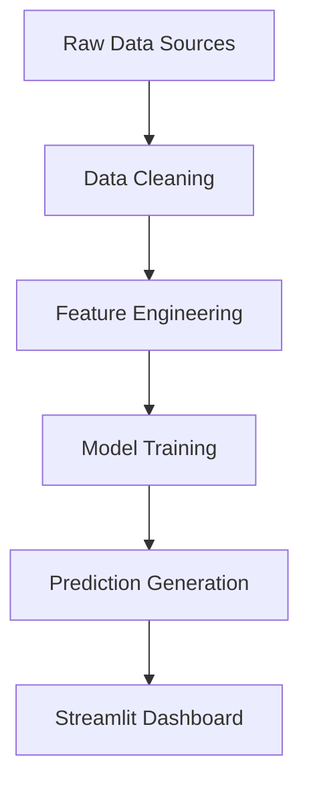

# 🇺🇳 UN Financial Intelligence Dashboard

> **A comprehensive AI-powered analytics platform for UN JointWork Plans financial data analysis, featuring predictive modeling, anomaly detection, and intelligent chatbot assistance.**

[](https://www.python.org/downloads/)
[](https://streamlit.io/)
[](LICENSE.md)

---

## 🌟 **Project Overview**

This dashboard provides comprehensive analysis of UN JointWork Plans financial data, enabling insights into funding patterns, resource allocation, and collaboration trends across different regions, themes, and UN agencies. Built with advanced machine learning models and an AI-powered chatbot for intelligent data exploration.

### **🎯 Key Features**
- 💰 **Funding Gap Analysis** - Identify and predict funding shortfalls across regions and themes
- 🌍 **Regional Intelligence** - Compare performance across Africa, Asia Pacific, Arab States, Europe & Central Asia, Latin America
- 🎯 **Thematic Analysis** - Deep dive into education, governance, environment, gender equality, and more
- 🤖 **AI-Powered Chat** - Interactive assistant for data exploration and insights
- 📊 **Predictive Modeling** - ML-driven predictions for SDG goals and agency recommendations
- 🔍 **Anomaly Detection** - Identify unusual patterns in strategic priorities

---

## 🏗️ **Complete Workflow Architecture**

### **1. Data Pipeline & Processing**


#### **📥 Data Sources**
- **Raw Regional Data**: [`src/data/`](src/data/) - Regional Excel files by theme across 5 regions (Africa, Asia Pacific, Arab States, Europe & Central Asia, Latin America)
- **Financial Dataset**: [`src/notebooks/Financial.csv`](src/notebooks/) - Core funding and expenditure data (~10.4 MB)
- **SDG Mapping**: [`src/notebooks/SDG_Goals.csv`](src/notebooks/) - Sustainable Development Goals alignment (~2.3 MB)
- **Agency Data**: [`src/notebooks/UN_Agencies.csv`](src/notebooks/) - UN agency collaboration metrics (~2.5 MB)
- **Processed Data**: [`src/outputs/data_output/`](src/outputs/data_output/) - Cleaned datasets (Financial_Cleaned.csv, SDG_Goals_Cleaned.csv, UN_Agencies_Cleaned.csv)

#### **🔧 Data Cleaning & Processing**
- **Main Processor**: [`src/notebooks/data_cleaning.ipynb`](src/notebooks/data_cleaning.ipynb) - Comprehensive data preprocessing pipeline
- **Configuration**: [`src/commonconst.py`](src/commonconst.py) - Central constants, paths, and utility functions
- **Outputs**: [`src/outputs/data_output/`](src/outputs/data_output/) - Cleaned and processed datasets

### **2. Machine Learning Models**

#### **🎯 SDG Prediction Model**
- **Training Notebook**: [`src/notebooks/sdg.ipynb`](src/notebooks/sdg.ipynb)
- **Model File**: [`src/outputs/model_output/SDG_model.pkl`](src/outputs/model_output/SDG_model.pkl)
- **Purpose**: Predict relevant Sustainable Development Goals based on country, theme, and strategic priorities

#### **🏢 Agency Recommendation Model**  
- **Training Notebook**: [`src/notebooks/agency.ipynb`](src/notebooks/agency.ipynb)
- **Model File**: [`src/outputs/model_output/Agency_model.pkl`](src/outputs/model_output/Agency_model.pkl)
- **Purpose**: Recommend optimal UN agencies for collaboration based on project characteristics

#### **💰 Funding Prediction System**
- **Analysis Notebook**: [`src/notebooks/funding.ipynb`](src/notebooks/funding.ipynb)
- **Output**: [`src/outputs/model_output/funding_prediction.csv`](src/outputs/model_output/funding_prediction.csv)
- **Purpose**: Forecast funding requirements and identify potential gaps

#### **🔍 Anomaly Detection Engine**
- **Detection Notebook**: [`src/notebooks/anomaly.ipynb`](src/notebooks/anomaly.ipynb)
- **Output**: [`src/outputs/model_output/anomaly_detection.csv`](src/outputs/model_output/anomaly_detection.csv)
- **Purpose**: Identify unusual patterns in strategic priorities and resource allocation

### **3. Streamlit Application Architecture**

#### **🚀 Main Application**
- **Entry Point**: [`app.py`](app.py) - Main application with navigation and configuration
- **Dependencies**: [`requirements.txt`](requirements.txt) - Python package dependencies
- **Secrets Management**: [`.streamlit/secrets.toml`](.streamlit/secrets.toml) - Azure OpenAI API configuration

#### **📱 Dashboard Pages**
- **Overview**: [`pages/overview.py`](pages/overview.py) - Executive summary and key metrics
- **Main Dashboard**: [`pages/main_page.py`](pages/main_page.py) - Interactive financial analysis and visualizations  
- **Predictive Analysis**: [`pages/prediction.py`](pages/prediction.py) - ML model results and trend analysis
- **Interactive Models**: [`pages/model.py`](pages/model.py) - Real-time predictions and scenario modeling
- **AI Chatbot**: [`pages/bot.py`](pages/bot.py) - Intelligent conversational interface

#### **🎨 Styling & Assets**
- **CSS Styling**: [`pages/style/style.css`](pages/style/style.css) - Custom UI styling and themes
- **AI Integration**: [`src/prompt.py`](src/prompt.py) - LLM prompt engineering and response handling

---

## ⚡ **Quick Start Guide**

### **1. Installation**
```bash
# Clone the repository
git clone https://github.com/your-username/United_Nations_Legacy.git
cd United_Nations_Legacy

# Install dependencies  
pip install -r requirements.txt

# Configure Azure OpenAI credentials
cp .streamlit/secrets.toml.example .streamlit/secrets.toml
# Edit secrets.toml with your API keys
```

### **2. Data Setup**

#### **📋 Required Data Files**
Due to file size constraints, the following data files are excluded from version control but are required for the application:

**Core Datasets** (place in `src/notebooks/`):
- `Financial.csv` (~10.4 MB) - Main financial dataset with funding, expenditure, and gap analysis
- `SDG_Goals.csv` (~2.3 MB) - Sustainable Development Goals mapping and analysis data  
- `UN_Agencies.csv` (~2.5 MB) - UN agency collaboration and performance data

**Regional Data** (organize in `src/data/`):
- `Africa/` - 11 thematic Excel files (crime, digital, education, environment, food, gender, governance, poverty, water, work, youth)
- `Arab States/` - 11 thematic Excel files
- `Asia Pacific/` - 11 thematic Excel files
- `Europe and Central Asia/` - 11 thematic Excel files
- `Latin America and the Caribbean/` - 11 thematic Excel files

**Generated Outputs** (automatically created):
- `src/outputs/data_output/` - Cleaned datasets ready for analysis
- `src/outputs/model_output/` - ML model files and predictions

> 💡 **Data Source**: All data originates from [UN INFO Data Explorer](https://uninfo.org/data-explorer/cooperation-framework/activity-report) - publicly available Cooperation Framework Joint Work Plans

### **3. Launch Application**
```bash
streamlit run app.py
```

### **4. Access Dashboard**
- **Local**: http://localhost:8501
- **Live Demo**: https://united-nations-legacy.streamlit.app/

> 🚀 **Try the Live Demo**: Experience the full dashboard with real UN data at the link above!

---

## 🎯 **How to Use the Dashboard**

### **📊 Overview Page**
- View executive summary of funding gaps and performance metrics
- Explore high-level regional and thematic trends
- Access quick insights and recommendations

### **🏠 Main Dashboard** 
- **Filter by**: Country, region, theme, year, UN agency
- **Visualizations**: Interactive maps, trend charts, funding gap analysis
- **Export**: Download filtered data and visualizations

### **📈 Predictive Analysis**
- **Model Performance**: View accuracy metrics and validation results
- **Trend Analysis**: Explore funding and performance trends over time
- **Anomaly Detection**: Identify unusual patterns and outliers

### **🎯 Interactive Models**
- **SDG Prediction**: Input project details to get relevant SDG recommendations
- **Agency Matching**: Find optimal UN agencies for collaboration
- **Scenario Modeling**: Test different funding and resource scenarios

### **🤖 AI Chatbot**
- **Natural Language Queries**: Ask questions in plain English
- **Data Exploration**: "What are the funding gaps in Africa for education?"
- **Comparative Analysis**: "Which agencies work most on climate action?"
- **Trend Insights**: "Show me resource allocation trends for governance projects"

---

## 🔧 **Technical Architecture**

### **🛠️ Tech Stack**
- **Frontend**: Streamlit (Python web framework)
- **Backend**: Python, Pandas, NumPy
- **Machine Learning**: Scikit-learn, XGBoost, LightGBM, CatBoost
- **Visualization**: Plotly, Seaborn
- **AI Integration**: Azure OpenAI (GPT-4, O1 models)
- **Data Processing**: Jupyter Notebooks, Excel/CSV handling

### **📦 Project Structure**
```
United_Nations_Legacy/
├── app.py                          # Main Streamlit application
├── requirements.txt                # Python dependencies & deployment config
├── README.md                       # Comprehensive project documentation
├── LICENSE.md                      # MIT license
├── .gitignore                      # Version control exclusions
├── pages/                          # Streamlit dashboard pages
│   ├── overview.py                 # Executive summary dashboard
│   ├── main_page.py               # Interactive financial analysis
│   ├── prediction.py              # ML model results & trends
│   ├── model.py                   # Real-time predictions interface
│   ├── bot.py                     # AI chatbot assistant
│   └── style/
│       └── style.css              # Custom UI styling
├── src/
│   ├── commonconst.py             # Configuration constants & utilities
│   ├── prompt.py                  # AI prompt engineering & LLM integration
│   ├── notebooks/                 # Data science workflows
│   │   ├── *.csv                  # Core datasets (excluded from git)
│   │   ├── data_cleaning.ipynb    # Data preprocessing pipeline
│   │   ├── sdg.ipynb             # SDG prediction model training
│   │   ├── agency.ipynb          # Agency recommendation model
│   │   ├── funding.ipynb         # Funding gap analysis
│   │   └── anomaly.ipynb         # Anomaly detection algorithms
│   ├── data/                      # Regional Excel files (excluded from git)
│   │   ├── Africa/               # 11 thematic datasets
│   │   ├── Arab States/          # 11 thematic datasets
│   │   ├── Asia Pacific/         # 11 thematic datasets
│   │   ├── Europe and Central Asia/ # 11 thematic datasets
│   │   └── Latin America and the Caribbean/ # 11 thematic datasets
│   └── outputs/                   # Generated analysis results
│       ├── data_output/           # Cleaned datasets for app
│       └── model_output/          # Trained ML models & predictions
└── .streamlit/
    └── secrets.toml               # API credentials (excluded from git)
```

---

## 🌍 **Use Cases & Applications**

### **👥 For UN Staff & Policy Experts**
- **Resource Planning**: Identify funding gaps and optimize allocation
- **Performance Monitoring**: Track agency collaboration and project outcomes  
- **Strategic Decision Making**: Data-driven insights for program planning
- **Cross-Regional Learning**: Compare best practices across regions

### **📊 For Data Analysts & Researchers**
- **Advanced Analytics**: Access to comprehensive UN financial datasets
- **Predictive Modeling**: ML-powered forecasting and scenario analysis
- **Anomaly Detection**: Identify unusual patterns requiring investigation
- **Custom Analysis**: Interactive filtering and data exploration

### **🎯 For Program Managers**
- **Project Planning**: SDG alignment and agency collaboration recommendations
- **Budget Optimization**: Funding gap analysis and resource prioritization  
- **Impact Assessment**: Performance tracking and trend analysis
- **Reporting**: Automated insights and visualization generation

---

## 🚀 **Development & Deployment**

### **🔄 Data Science Workflow**
1. **Data Collection**: Regional Excel files and financial datasets
2. **Preprocessing**: Clean, standardize, and engineer features
3. **Model Training**: SDG prediction, agency recommendation, anomaly detection
4. **Validation**: Cross-validation and performance testing  
5. **Deployment**: Model integration into Streamlit dashboard

### **☁️ Deployment Options**

#### **🌐 Streamlit Cloud (Recommended)**
1. **Connect Repository**: Link your GitHub repository to [Streamlit Cloud](https://share.streamlit.io/)
2. **Configure Secrets**: Add Azure OpenAI credentials in Streamlit Cloud settings:
   ```bash
   AZURE_OPENAI_4O_API_KEY = "your-api-key-here"
   AZURE_OPENAI_4O_API_VERSION = "2024-02-15-preview"  
   AZURE_OPENAI_4O_ENDPOINT = "https://your-resource.openai.azure.com/"
   AZURE_OPENAI_4O_DEPLOYMENT = "your-deployment-name"
   
   AZURE_OPENAI_O1_API_KEY = "your-api-key-here"
   AZURE_OPENAI_O1_API_VERSION = "2024-09-01-preview"
   AZURE_OPENAI_O1_ENDPOINT = "https://your-resource.openai.azure.com/"
   AZURE_OPENAI_O1_DEPLOYMENT = "your-deployment-name"
   ```
3. **Deploy**: Streamlit Cloud automatically detects `requirements.txt` and deploys

#### **💻 Local Development**
```bash
pip install -r requirements.txt
streamlit run app.py
```

#### **🐳 Docker Deployment**
```dockerfile
FROM python:3.11.9-slim
RUN apt-get update && apt-get install -y build-essential python3-dev
COPY requirements.txt .
RUN pip install -r requirements.txt
COPY . /app
WORKDIR /app
EXPOSE 8501
CMD ["streamlit", "run", "app.py"]
```

#### **🆘 Troubleshooting**
If Streamlit Cloud deployment fails, create these files:
- `runtime.txt`: `python-3.11.9`
- `packages.txt`: `build-essential\npython3-dev`

### **🔒 Security & Privacy**
- **API Security**: Azure OpenAI credentials via environment variables
- **Data Privacy**: Sensitive data excluded from version control
- **Access Control**: Configure authentication as needed for deployment

---

## 📞 **Contact & Support**

- **Developer**: Zichen Zhao (Jackson)
- **Email**: ziche.zhao@un.org or zichen.zhao@columbia.edu 
- **Organization**: United Nations Development Coordination Office (UNDCO)
- **GitHub**: [Repository Issues](https://github.com/ZhaoJackson/United_Nations_Legacy/issues)

---

## 📄 **License**

This project is licensed under the MIT License - see the [LICENSE.md](LICENSE.md) file for details.

---

## 🙏 **Acknowledgments**

- UN Development Coordination Office (UNDCO)
- UN Country Teams contributing data from https://uninfo.org/data-explorer/cooperation-framework/activity-report
- Azure AI Foundry for enterprise AI infrastructure 
- Open source community for tools and libraries

---

## 🌟 **Mission & Impact**

This dashboard represents a commitment to **data-driven transparency** in UN programming, enabling:

- **Evidence-Based Policy**: Transform complex financial data into actionable insights for strategic decision-making
- **Resource Optimization**: Identify funding gaps and opportunities for more effective resource allocation  
- **Cross-Regional Learning**: Facilitate knowledge sharing and best practice identification across UN Country Teams
- **Accountability & Transparency**: Provide clear visibility into UN JointWork Plans financial performance and outcomes

> **Empowering the UN system with intelligent analytics for more effective development cooperation worldwide.**

---

*Built with mission for evidence-based decision-making in UN programming* 🇺🇳