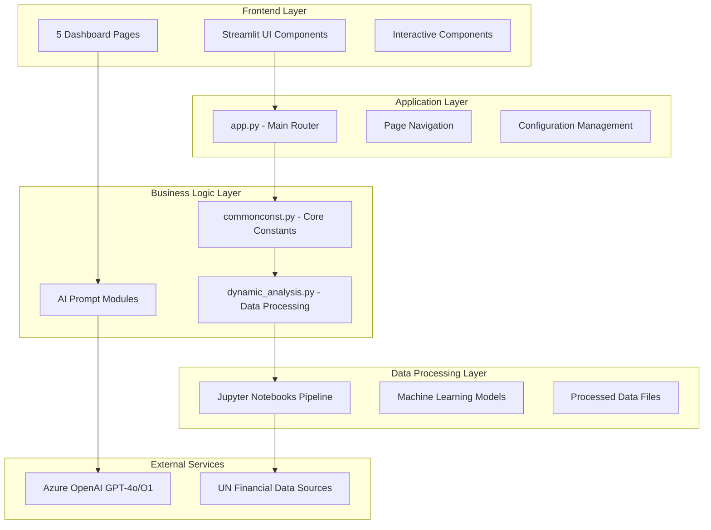
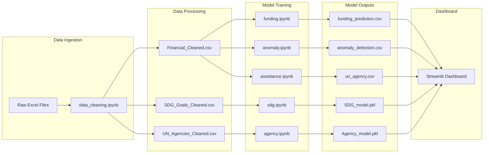

# 🏗️ Architecture Overview

Comprehensive architectural documentation for the UN Financial Intelligence Dashboard.

## 🎯 **System Architecture**



## 🧩 **Component Architecture**

### **1. Frontend Layer (Streamlit)**

- **Framework**: Streamlit 1.47+
- **Pattern**: Multi-page application with shared state
- **Styling**: Custom CSS with UN branding
- **Responsiveness**: Adaptive layouts for different screen sizes

### **2. Application Layer**

- **Entry Point**: `app.py` - Single point of entry
- **Navigation**: Page-based routing system
- **Configuration**: Centralized settings management
- **State Management**: Session state for user interactions

### **3. Business Logic Layer**

- **Core Module**: `src/commonconst.py` - Shared utilities and constants
- **Data Processing**: `src/dynamic_analysis.py` - Advanced data operations
- **AI Integration**: `src/prompt/` - Specialized AI prompt modules

### **4. Data Layer**

- **Raw Data**: Excel files from UN data sources
- **Processed Data**: Cleaned CSV files ready for analysis
- **Model Artifacts**: Trained ML models and predictions
- **Pipeline**: Jupyter notebooks for data transformation

## 📊 **Data Flow Architecture**



## 🤖 **AI Integration Architecture**

### **Azure OpenAI Integration**

```python
# Architecture Pattern
Client Configuration → Model Selection → Prompt Engineering → Response Processing

# GPT-4o: Conversational AI and Strategic Analysis
# O1: Complex reasoning and strategic insights
```

### **AI Module Structure**

- **`chatbot.py`**: Natural language interface with context awareness
- **`dashboard.py`**: Strategic insights generation for financial data
- **`models.py`**: ML prediction analysis and recommendations
- **`funding_prediction.py`**: Financial forecasting insights
- **`anomaly_detection.py`**: Risk assessment and investigation priorities
- **`agency_performance.py`**: Performance optimization recommendations

## 🗃️ **Database Architecture**

### **Data Storage Pattern**
- **Format**: CSV files for maximum compatibility
- **Structure**: Denormalized for analytical performance
- **Indexing**: Country, Region, Theme, Year-based access patterns
- **Caching**: Streamlit @st.cache_data for performance

### **Data Relationships**

```
Financial Data (Core)
├── Strategic Priorities (1:N)
├── UN Agencies (N:M)
├── SDG Goals (N:M)
├── Countries (N:1)
├── Regions (N:1)
└── Themes (N:1)
```

## 🔄 **Processing Pipeline Architecture**

### **ETL Pipeline Stages**

1. **Extract**: Load Excel files from multiple regions/themes
2. **Transform**: 
   - Standardize column names
   - Create unified schema
   - Calculate derived metrics
   - Handle missing values
3. **Load**: Save to structured CSV files

### **ML Pipeline Stages**

1. **Data Preparation**: Feature engineering and preprocessing
2. **Model Training**: Multi-label classification and regression
3. **Validation**: Cross-validation and performance metrics
4. **Deployment**: Model serialization and integration

## 🎨 **Frontend Architecture**

### **Page Architecture**

```
app.py (Router)
├── pages/overview.py (Platform overview + tabs)
├── pages/main_page.py (Interactive dashboard + AI insights)
├── pages/prediction.py (ML analytics + 3 tabs)
├── pages/model.py (Real-time predictions + AI analysis)
└── pages/bot.py (Conversational AI + statistics)
```

### **Component Hierarchy**

```
Streamlit App
├── Page Configuration (PAGE_CONFIG)
├── Navigation (st.navigation)
├── Sidebar Filters (Universal)
├── Main Content Area
│   ├── Header Section
│   ├── Interactive Components
│   ├── Visualization Charts
│   └── AI Insights Section
└── Footer (Branding)
```

## 🔧 **Configuration Architecture**

### **Configuration Layers**

1. **Application Config** (`src/commonconst.py`)
   - Page settings
   - Color schemes
   - Default values
   - File paths

2. **Secrets Management** (`.streamlit/secrets.toml`)
   - Azure OpenAI credentials
   - API configurations
   - Environment-specific settings

3. **Streamlit Config** (`.streamlit/config.toml`)
   - Server settings
   - Performance tuning
   - Security options

### **Environment Handling**

```python
# Development
DEBUG = True
CACHE_TTL = 300  # 5 minutes

# Production  
DEBUG = False
CACHE_TTL = 3600  # 1 hour
```

## 🚀 **Deployment Architecture**

### **Streamlit Cloud Architecture**

```
GitHub Repository
├── Automatic Deployment Trigger
├── Dependency Resolution
├── Environment Setup
└── Application Launch

Production Environment
├── Python 3.11.9 Runtime
├── Streamlit Cloud Infrastructure
├── Azure OpenAI Integration
└── CDN for Static Assets
```

### **Docker Architecture (Alternative)**

```dockerfile
# Multi-stage build
FROM python:3.11.9-slim as base
├── System Dependencies
├── Python Dependencies
├── Application Code
└── Runtime Configuration
```

## 📈 **Performance Architecture**

### **Caching Strategy**

```python
# Data Caching
@st.cache_data(ttl=3600)
def load_financial_data():
    return pd.read_csv(FINANCIAL_PATH)

# Resource Caching
@st.cache_resource
def load_ml_models():
    return joblib.load(MODEL_PATH)
```

### **Memory Management**

- **Lazy Loading**: Load data only when needed
- **Chunked Processing**: Handle large datasets in chunks
- **Memory Monitoring**: Track usage and optimize
- **Garbage Collection**: Explicit cleanup for large objects

## 🔒 **Security Architecture**

### **Security Layers**

1. **Application Security**
   - Input validation
   - XSS prevention
   - CSRF protection

2. **Data Security**
   - File permission management
   - Sensitive data exclusion
   - Access control

3. **API Security**
   - Credential management
   - Rate limiting
   - Error handling

### **Security Patterns**

```python
# Credential Management
secrets = st.secrets["AZURE_OPENAI"]

# Input Validation  
validated_input = validate_country_name(user_input)

# Error Handling
try:
    result = api_call()
except Exception as e:
    st.error("Service temporarily unavailable")
    logger.error(f"API error: {e}")
```

## 🧪 **Testing Architecture**

### **Testing Pyramid**

```
End-to-End Tests (Streamlit App Testing)
├── Integration Tests (Module Integration)
├── Unit Tests (Function Testing)
└── Static Analysis (Code Quality)
```

### **Testing Strategies**

- **Unit Tests**: Individual function validation
- **Integration Tests**: Module interaction testing
- **UI Tests**: Streamlit app behavior testing
- **Performance Tests**: Load and stress testing

## 📊 **Monitoring Architecture**

### **Observability Stack**

```
Application Metrics
├── Performance Monitoring
├── Error Tracking
├── Usage Analytics
└── Resource Utilization

External Services
├── Azure OpenAI API Status
├── Data Source Availability
└── Third-party Dependencies
```

## 🔄 **Scalability Architecture**

### **Horizontal Scaling**

- **Stateless Design**: No server-side session storage
- **Load Balancing**: Multiple application instances
- **Data Replication**: Distributed data access

### **Vertical Scaling**

- **Memory Optimization**: Efficient data structures
- **CPU Optimization**: Vectorized operations
- **I/O Optimization**: Asynchronous data loading

## 🎯 **Design Patterns**

### **Applied Patterns**

1. **MVC Pattern**: Separation of concerns
2. **Factory Pattern**: Dynamic component creation
3. **Observer Pattern**: Reactive UI updates
4. **Strategy Pattern**: Interchangeable algorithms
5. **Decorator Pattern**: Function enhancement with caching

### **Streamlit Patterns**

```python
# Page Pattern
def render_page():
    setup_page_config()
    render_sidebar()
    render_main_content()
    render_footer()

# Component Pattern
@st.fragment
def render_metric_card(title, value, delta):
    # Reusable component logic
    pass

# State Management Pattern
if 'key' not in st.session_state:
    st.session_state.key = default_value
```

---

## 🎯 **Architectural Decisions & Rationale**

### **Technology Choices**

| Component | Choice | Rationale |
|-----------|--------|-----------|
| **Frontend** | Streamlit | Rapid development, Python-native, great for data apps |
| **ML Framework** | Scikit-learn + XGBoost | Proven performance, easy deployment |
| **AI Integration** | Azure OpenAI | Enterprise-grade, reliable API |
| **Data Format** | CSV | Universal compatibility, easy debugging |
| **Deployment** | Streamlit Cloud | Zero-config deployment, automatic scaling |

### **Design Principles**

1. **Modularity**: Clear separation of concerns
2. **Maintainability**: Well-documented, testable code
3. **Performance**: Optimized for data-intensive operations
4. **Usability**: Intuitive interface for non-technical users
5. **Scalability**: Designed for growth and expansion

---

**🔄 Next Steps**: Explore the [File Structure Guide](./05_FILE_STRUCTURE.md) for detailed code organization, or proceed to [Development Workflow](./06_DEVELOPMENT_WORKFLOW.md) for contribution guidelines.