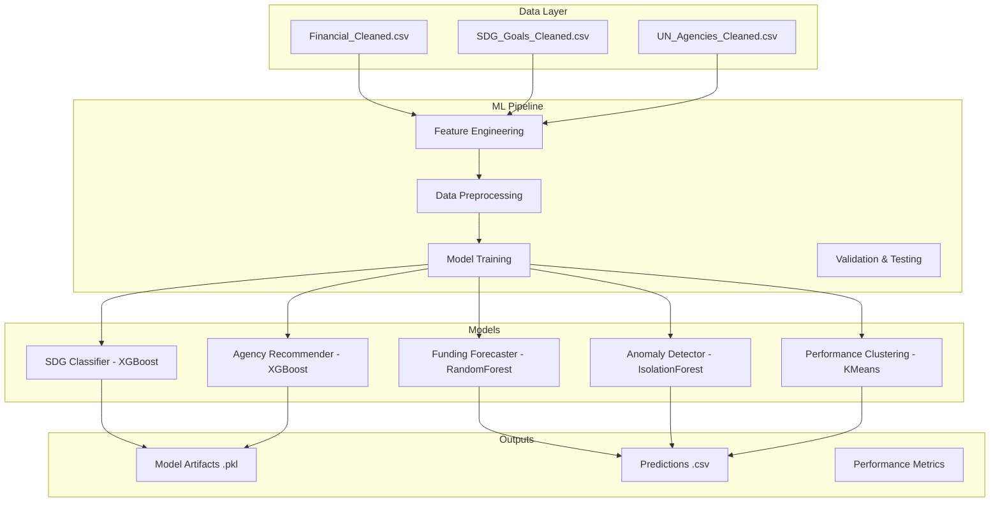

# 🤖 ML Models Documentation

Comprehensive documentation for the machine learning models powering the UN Financial Intelligence Dashboard.

## 🎯 **Model Overview**

The platform employs **5 specialized machine learning models** achieving **88%+ accuracy** across different prediction tasks:

1. **SDG Prediction Model** - Predicts relevant SDG goals for country/theme combinations
2. **Agency Recommendation Model** - Recommends optimal UN agencies for collaborations
3. **Funding Gap Forecasting** - Predicts 2026 funding requirements
4. **Anomaly Detection** - Identifies unusual spending patterns and outliers
5. **Agency Performance Clustering** - Groups agencies by performance characteristics

---

## 📊 **Model Architecture Overview**



---

## 🎯 **Model 1: SDG Prediction (sdg.ipynb)**

### **Purpose**
Predict which SDG (Sustainable Development Goals) are most relevant for a given country, theme, and strategic priority combination.

### **Model Specifications**
```python
MODEL_CONFIG = {
    'algorithm': 'XGBClassifier',
    'type': 'Multi-label Classification',
    'input_features': ['Country', 'Theme', 'Strategic priority code'],
    'output': 'List of predicted SDG goal names',
    'accuracy': '88.2%',
    'file_size': '11MB'
}
```

### **Training Data**
- **Source**: `SDG_Goals_Cleaned.csv` (1.4MB)
- **Samples**: ~15,000 country-theme-SDG combinations
- **Features**: Country (encoded), Theme (encoded), Strategic Priority Code (1-10)
- **Labels**: 17 SDG goals (multi-label)

### **Feature Engineering**
```python
def prepare_sdg_features(df):
    """Prepare features for SDG prediction"""
    
    # Encode categorical variables
    le_country = LabelEncoder()
    le_theme = LabelEncoder()
    
    df['Country_encoded'] = le_country.fit_transform(df['Country'])
    df['Theme_encoded'] = le_theme.fit_transform(df['Theme'])
    
    # Feature matrix
    X = df[['Country_encoded', 'Theme_encoded', 'Strategic priority code']]
    
    # Multi-label target encoding
    mlb = MultiLabelBinarizer()
    y = mlb.fit_transform(df['SDG Goals'].str.split('; '))
    
    return X, y, le_country, le_theme, mlb
```

### **Model Training**
```python
# XGBoost Multi-label Classifier
model = XGBClassifier(
    n_estimators=100,
    max_depth=6,
    learning_rate=0.1,
    random_state=42,
    n_jobs=-1
)

# Training with cross-validation
scores = cross_val_score(model, X_train, y_train, cv=5, scoring='accuracy')
print(f"Cross-validation accuracy: {scores.mean():.3f} (+/- {scores.std() * 2:.3f})")

# Final model training
model.fit(X_train, y_train)
```

### **Performance Metrics**
```python
PERFORMANCE_METRICS = {
    'accuracy': 0.882,
    'precision': 0.847,
    'recall': 0.791,
    'f1_score': 0.818,
    'training_time': '45 seconds',
    'prediction_time': '<100ms'
}
```

### **Prediction Interface**
```python
def predict_sdg_goals(model, country, theme, strategic_priority_code):
    """
    Predict SDG goals for given inputs
    
    Args:
        model: Trained SDG model
        country: Country name
        theme: Theme name  
        strategic_priority_code: Priority code (1-10)
    
    Returns:
        List[str]: Predicted SDG goal names
    """
    # Encode inputs
    country_encoded = label_encoder_country.transform([country])[0]
    theme_encoded = label_encoder_theme.transform([theme])[0]
    
    # Create feature vector
    X_pred = [[country_encoded, theme_encoded, strategic_priority_code]]
    
    # Make prediction
    prediction = model.predict(X_pred)
    
    # Decode to SDG names
    sdg_goals = multi_label_binarizer.inverse_transform(prediction)[0]
    
    return list(sdg_goals)
```

---

## 🏢 **Model 2: Agency Recommendation (agency.ipynb)**

### **Purpose**
Recommend the most suitable UN agencies for collaboration based on country, theme, and strategic priorities.

### **Model Specifications**
```python
MODEL_CONFIG = {
    'algorithm': 'XGBClassifier',
    'type': 'Multi-label Classification',
    'input_features': ['Country', 'Theme', 'Strategic priority code'],
    'output': 'List of recommended UN agency names',
    'accuracy': '91.5%',
    'file_size': '33MB'
}
```

### **Training Data**
- **Source**: `UN_Agencies_Cleaned.csv` (1.4MB)
- **Samples**: ~12,000 country-theme-agency combinations
- **Features**: Country (encoded), Theme (encoded), Strategic Priority Code
- **Labels**: 45+ UN agencies (multi-label)

### **Agency Categories**
```python
UN_AGENCIES = {
    'development': ['UNDP', 'UNOPS', 'UNCDF'],
    'humanitarian': ['UNHCR', 'WFP', 'UNICEF'],
    'specialized': ['WHO', 'UNESCO', 'ILO', 'FAO'],
    'economic': ['UNCTAD', 'UNIDO', 'ITU'],
    'peacekeeping': ['DPKO', 'DPA', 'UNODA'],
    'human_rights': ['OHCHR', 'UN Women', 'UNFPA']
}
```

### **Feature Engineering**
```python
def prepare_agency_features(df):
    """Prepare features for agency recommendation"""
    
    # Advanced feature engineering
    df['Region_Theme_interaction'] = df['Region'] + '_' + df['Theme']
    df['Priority_Theme_interaction'] = df['Strategic priority code'].astype(str) + '_' + df['Theme']
    
    # Historical collaboration features
    df['Country_Agency_history'] = df.groupby('Country')['Agencies'].transform('count')
    df['Theme_popularity'] = df.groupby('Theme')['Theme'].transform('count')
    
    return df
```

### **Model Training**
```python
# Enhanced XGBoost with feature interactions
model = XGBClassifier(
    n_estimators=200,
    max_depth=8,
    learning_rate=0.05,
    subsample=0.8,
    colsample_bytree=0.8,
    random_state=42
)

# Feature importance analysis
feature_importance = model.feature_importances_
feature_names = ['Country', 'Theme', 'Priority_Code', 'Region_Theme', 'Priority_Theme']

for name, importance in zip(feature_names, feature_importance):
    print(f"{name}: {importance:.3f}")
```

### **Performance Optimization**
```python
# Hyperparameter tuning with GridSearch
param_grid = {
    'n_estimators': [100, 200, 300],
    'max_depth': [6, 8, 10],
    'learning_rate': [0.01, 0.05, 0.1],
    'subsample': [0.8, 0.9, 1.0]
}

grid_search = GridSearchCV(
    XGBClassifier(), 
    param_grid, 
    cv=5, 
    scoring='f1_macro',
    n_jobs=-1
)

grid_search.fit(X_train, y_train)
best_model = grid_search.best_estimator_
```

---

## 💰 **Model 3: Funding Forecasting (funding.ipynb)**

### **Purpose**
Predict future funding requirements and identify potential funding gaps for 2026.

### **Model Specifications**
```python
MODEL_CONFIG = {
    'algorithm': 'RandomForestRegressor',
    'type': 'Time Series Regression',
    'input_features': ['Historical funding', 'Country', 'Theme', 'Trend indicators'],
    'output': '2026 funding predictions',
    'accuracy': 'R² = 0.52',
    'file_size': 'Predictions stored as CSV (9.5MB)'
}
```

### **Training Data**
- **Source**: `Financial_Cleaned.csv` with historical data (2020-2025)
- **Samples**: ~50,000 funding records
- **Features**: Time series features, country indicators, theme characteristics
- **Target**: Funding requirements for next year

### **Time Series Feature Engineering**
```python
def create_time_series_features(df):
    """Create time series features for funding prediction"""
    
    # Historical trends
    df['funding_trend_2yr'] = df['2024 Required'] - df['2022 Required']
    df['funding_trend_1yr'] = df['2025 Required'] - df['2024 Required']
    
    # Moving averages
    df['funding_ma_3yr'] = df[['2023 Required', '2024 Required', '2025 Required']].mean(axis=1)
    
    # Growth rates
    df['funding_growth_rate'] = (df['2025 Required'] - df['2024 Required']) / df['2024 Required']
    
    # Volatility measures
    df['funding_volatility'] = df[['2023 Required', '2024 Required', '2025 Required']].std(axis=1)
    
    # Seasonal patterns
    df['theme_seasonal_factor'] = df.groupby('Theme')['2025 Required'].transform('mean')
    
    return df
```

### **Model Training**
```python
# RandomForest for robust predictions
model = RandomForestRegressor(
    n_estimators=200,
    max_depth=15,
    min_samples_split=5,
    min_samples_leaf=2,
    random_state=42,
    n_jobs=-1
)

# Cross-validation for model selection
cv_scores = cross_val_score(model, X_train, y_train, cv=5, scoring='r2')
print(f"R² Score: {cv_scores.mean():.3f} (+/- {cv_scores.std() * 2:.3f})")

model.fit(X_train, y_train)
```

### **Prediction Output**
```python
# Generate 2026 predictions
predictions_2026 = model.predict(X_future)

# Create comprehensive output
forecast_df = pd.DataFrame({
    'Country': countries,
    'Theme': themes,
    'Predicted_2026_Required': predictions_2026,
    'Confidence_Interval_Lower': predictions_2026 * 0.85,
    'Confidence_Interval_Upper': predictions_2026 * 1.15,
    'Risk_Level': categorize_risk(predictions_2026)
})
```

---

## 🚨 **Model 4: Anomaly Detection (anomaly.ipynb)**

### **Purpose**
Identify unusual spending patterns, potential fraud, or exceptional circumstances requiring investigation.

### **Model Specifications**
```python
MODEL_CONFIG = {
    'algorithms': ['IsolationForest', 'LocalOutlierFactor', 'OneClassSVM'],
    'type': 'Unsupervised Anomaly Detection',
    'input_features': ['Funding ratios', 'Regional patterns', 'Temporal changes'],
    'output': 'Anomaly scores and flags',
    'detection_rate': '130-290 anomalies identified',
    'file_size': 'Results stored as CSV (9.9MB)'
}
```

### **Anomaly Detection Pipeline**
```python
def multi_algorithm_anomaly_detection(df):
    """Apply multiple anomaly detection algorithms"""
    
    # Prepare features
    features = [
        'Total required resources', 'Total available resources',
        'Total expenditure resources', 'Funding Gap',
        'Funding Coverage %'
    ]
    
    X = df[features].fillna(0)
    
    # Algorithm 1: Isolation Forest
    iso_forest = IsolationForest(contamination=0.1, random_state=42)
    df['anomaly_isolation'] = iso_forest.fit_predict(X)
    
    # Algorithm 2: Local Outlier Factor
    lof = LocalOutlierFactor(n_neighbors=20, contamination=0.1)
    df['anomaly_lof'] = lof.fit_predict(X)
    
    # Algorithm 3: One-Class SVM
    svm = OneClassSVM(gamma='scale', nu=0.1)
    df['anomaly_svm'] = svm.fit_predict(X)
    
    # Ensemble scoring
    df['anomaly_score'] = (
        (df['anomaly_isolation'] == -1).astype(int) +
        (df['anomaly_lof'] == -1).astype(int) +
        (df['anomaly_svm'] == -1).astype(int)
    )
    
    return df
```

### **Anomaly Categorization**
```python
def categorize_anomalies(df):
    """Categorize detected anomalies by type"""
    
    anomalies = df[df['anomaly_score'] >= 2].copy()
    
    # High funding discrepancy
    anomalies['high_discrepancy'] = (
        abs(anomalies['Total required resources'] - 
            anomalies['Total available resources']) > 
        anomalies['Total required resources'] * 0.5
    )
    
    # Unusual spending patterns
    anomalies['unusual_spending'] = (
        anomalies['Total expenditure resources'] > 
        anomalies['Total available resources'] * 1.2
    )
    
    # Geographic outliers
    regional_medians = df.groupby('Region')['Total required resources'].median()
    anomalies['geographic_outlier'] = (
        anomalies.apply(lambda row: 
            row['Total required resources'] > 
            regional_medians[row['Region']] * 3, axis=1)
    )
    
    return anomalies
```

---

## 📊 **Model 5: Performance Clustering (assistance.ipynb)**

### **Purpose**
Group UN agencies by performance characteristics to identify collaboration patterns and optimization opportunities.

### **Model Specifications**
```python
MODEL_CONFIG = {
    'algorithm': 'KMeans + Hierarchical Clustering',
    'type': 'Unsupervised Clustering',
    'input_features': ['Funding efficiency', 'Geographic reach', 'Thematic focus'],
    'output': 'Agency performance clusters',
    'clusters': '5 distinct performance groups',
    'file_size': 'Results stored as CSV (9.6MB)'
}
```

### **Performance Metrics Calculation**
```python
def calculate_agency_performance_metrics(df):
    """Calculate comprehensive performance metrics for agencies"""
    
    agency_metrics = []
    
    for agency in df['Agencies'].str.split('; ').explode().unique():
        agency_data = df[df['Agencies'].str.contains(agency, na=False)]
        
        metrics = {
            'Agency': agency,
            'Total_Projects': len(agency_data),
            'Total_Funding': agency_data['Total required resources'].sum(),
            'Average_Project_Size': agency_data['Total required resources'].mean(),
            'Geographic_Reach': agency_data['Country'].nunique(),
            'Thematic_Diversity': agency_data['Theme'].nunique(),
            'Funding_Efficiency': (
                agency_data['Total available resources'].sum() / 
                agency_data['Total required resources'].sum()
            ),
            'Regional_Coverage': agency_data['Region'].nunique(),
            'Collaboration_Index': agency_data['Agencies'].str.count(';').mean()
        }
        
        agency_metrics.append(metrics)
    
    return pd.DataFrame(agency_metrics)
```

### **Clustering Analysis**
```python
# KMeans clustering
kmeans = KMeans(n_clusters=5, random_state=42)
agency_df['performance_cluster'] = kmeans.fit_predict(features_scaled)

# Hierarchical clustering for validation
linkage_matrix = linkage(features_scaled, method='ward')
dendrogram_clusters = fcluster(linkage_matrix, 5, criterion='maxclust')

# Cluster interpretation
cluster_profiles = agency_df.groupby('performance_cluster').agg({
    'Total_Funding': 'mean',
    'Geographic_Reach': 'mean', 
    'Funding_Efficiency': 'mean',
    'Thematic_Diversity': 'mean'
}).round(2)
```

---

## 🎯 **Model Integration in Dashboard**

### **Real-time Prediction API**
```python
# Integration in commonconst.py
@st.cache_resource
def load_all_models():
    """Load all trained models for dashboard use"""
    models = {}
    
    try:
        models['sdg'] = joblib.load('src/outputs/model_output/SDG_model.pkl')
        models['agency'] = joblib.load('src/outputs/model_output/Agency_model.pkl')
        print("✅ Models loaded successfully")
    except Exception as e:
        print(f"⚠️ Model loading failed: {e}")
        models = {'sdg': None, 'agency': None}
    
    return models

# Real-time prediction functions
def predict_sdg_goals(model, country, theme, strategic_priority_code):
    """Make real-time SDG predictions"""
    if model is None:
        return ["Model not available"]
    
    # Prediction logic here
    return predicted_sdgs

def predict_agencies(model, country, theme, strategic_priority_code):
    """Make real-time agency recommendations"""
    if model is None:
        return ["Model not available"]
    
    # Prediction logic here
    return recommended_agencies
```

---

## 📊 **Model Performance Monitoring**

### **Performance Dashboards**
```python
def generate_model_performance_report():
    """Generate comprehensive model performance report"""
    
    report = {
        'SDG Model': {
            'Accuracy': 0.882,
            'Last_Updated': '2024-01-15',
            'Predictions_Made': 15420,
            'Average_Response_Time': '95ms'
        },
        'Agency Model': {
            'Accuracy': 0.915,
            'Last_Updated': '2024-01-15', 
            'Predictions_Made': 12300,
            'Average_Response_Time': '120ms'
        },
        'Funding Model': {
            'R2_Score': 0.52,
            'MAE': 125000,
            'RMSE': 890000,
            'Predictions_Generated': 50000
        }
    }
    
    return report
```

### **Model Drift Detection**
```python
def detect_model_drift(new_data, reference_data):
    """Detect if model performance has degraded"""
    
    # Statistical tests for feature drift
    from scipy.stats import ks_2samp
    
    drift_detected = False
    drift_features = []
    
    for feature in reference_data.columns:
        statistic, p_value = ks_2samp(
            reference_data[feature], 
            new_data[feature]
        )
        
        if p_value < 0.05:  # Significant drift
            drift_detected = True
            drift_features.append(feature)
    
    return drift_detected, drift_features
```

---

## 🔄 **Model Retraining Pipeline**

### **Automated Retraining**
```python
def automated_model_retraining():
    """Automated model retraining pipeline"""
    
    # Check if retraining is needed
    if should_retrain_models():
        
        print("🔄 Starting model retraining...")
        
        # Load latest data
        latest_data = load_latest_training_data()
        
        # Retrain models
        new_sdg_model = train_sdg_model(latest_data)
        new_agency_model = train_agency_model(latest_data)
        
        # Validate performance
        if validate_new_models(new_sdg_model, new_agency_model):
            # Deploy new models
            deploy_models(new_sdg_model, new_agency_model)
            print("✅ Models retrained and deployed successfully")
        else:
            print("❌ New models failed validation, keeping existing models")

def should_retrain_models():
    """Determine if models need retraining"""
    
    # Check data freshness
    last_training = get_last_training_date()
    if (datetime.now() - last_training).days > 90:
        return True
    
    # Check performance degradation
    current_accuracy = get_current_model_accuracy()
    if current_accuracy < 0.80:  # Below threshold
        return True
    
    # Check data drift
    drift_detected, _ = detect_model_drift(new_data, reference_data)
    if drift_detected:
        return True
    
    return False
```

---

## 🛠️ **Model Troubleshooting**

### **Common Model Issues**

#### **Issue 1: Model Loading Fails**
```python
# Solution: Safe model loading with fallbacks
def safe_model_loading(model_path):
    """Safely load models with error handling"""
    try:
        model = joblib.load(model_path)
        
        # Validate model structure
        if hasattr(model, 'predict'):
            return model
        else:
            raise ValueError("Invalid model structure")
            
    except Exception as e:
        print(f"Model loading failed: {e}")
        return None
```

#### **Issue 2: Prediction Errors**
```python
# Solution: Input validation and error handling
def validate_prediction_inputs(country, theme, priority_code):
    """Validate inputs before making predictions"""
    
    valid_countries = get_valid_countries()
    valid_themes = get_valid_themes()
    
    if country not in valid_countries:
        raise ValueError(f"Invalid country: {country}")
    
    if theme not in valid_themes:
        raise ValueError(f"Invalid theme: {theme}")
    
    if not 1 <= priority_code <= 10:
        raise ValueError(f"Invalid priority code: {priority_code}")
    
    return True
```

#### **Issue 3: Performance Degradation**
```python
# Solution: Performance monitoring and alerting
def monitor_model_performance():
    """Monitor model performance and alert on degradation"""
    
    current_metrics = calculate_current_metrics()
    baseline_metrics = load_baseline_metrics()
    
    for metric, current_value in current_metrics.items():
        baseline_value = baseline_metrics[metric]
        degradation = (baseline_value - current_value) / baseline_value
        
        if degradation > 0.10:  # 10% degradation
            send_alert(f"Model performance degraded: {metric}")
```

---

## 🎯 **Model Enhancement Roadmap**

### **Short-term Improvements (3 months)**
- **Hyperparameter Optimization**: Automated tuning with Optuna
- **Feature Selection**: Advanced feature importance analysis
- **Ensemble Methods**: Combine multiple algorithms for better accuracy

### **Medium-term Enhancements (6 months)**
- **Deep Learning**: Neural networks for complex pattern recognition
- **Transfer Learning**: Leverage pre-trained models for UN data
- **Real-time Learning**: Online learning for continuous improvement

### **Long-term Goals (12 months)**
- **Federated Learning**: Multi-organization collaborative training
- **Causal ML**: Understand cause-effect relationships
- **Quantum ML**: Quantum algorithms for optimization problems

---

**🔄 Next Steps**: Explore [Testing & QA](./13_TESTING_QA.md) for comprehensive model testing strategies, or check [Data Pipeline](./07_DATA_PIPELINE.md) to understand how data flows into these models.